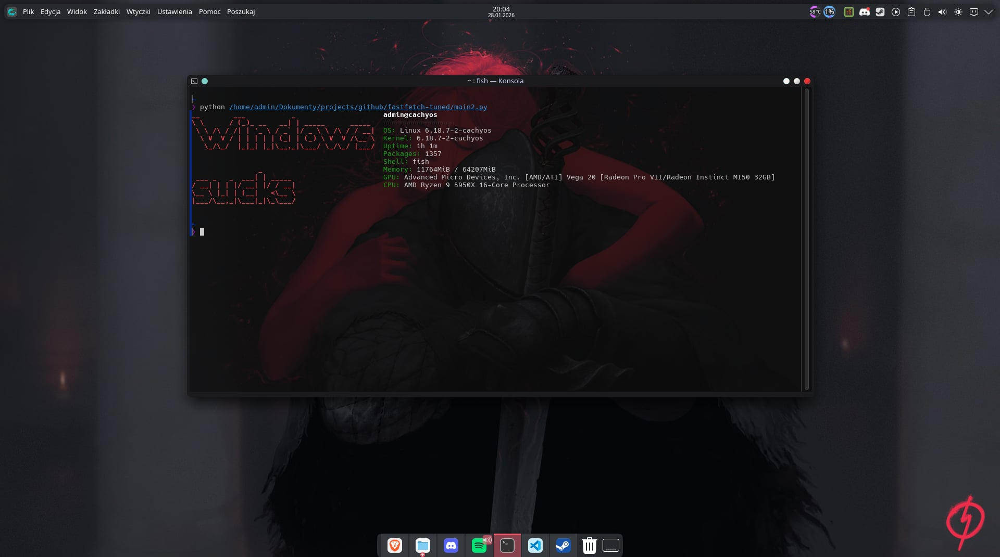

# main

A lightweight, terminal-based system information tool written in Python. It detects hardware specifications and displays them alongside a custom ASCII text banner.

## 🛠 Features

* **Hardware Detection**: Identifies CPU models and GPU details, including VRAM for NVIDIA and AMD cards.
* **System Stats**: Displays Uptime, Shell environment, Memory usage, and Kernel version.
* **Package Counting**: Built-in support for counting installed packages via `pacman`.
* **ASCII Banner**: Renders large, high-visibility text banners using `figlet` or internal fallback methods.

## 📦 Installation

Install the necessary dependencies based on your distribution.

### Arch Linux

As per your environment setup, use `sudo` to install the required system packages:

```bash
sudo pacman -S python-psutil python-pillow figlet

```

### Debian / Ubuntu

sudo apt update
sudo apt install python3-psutil python3-pil figlet


## 🚀 Quick Start

1. **Clone the repository**:
```bash
git clone https://github.com/your-username/main.git
cd main

```


2. **Run the script**:
```bash
python main.py

```


## ⚙️ Configuration

You can customize the information displayed by editing the script:

* **Banner Text**: Modify the `generate_big_text` function calls in the `display_fetch` section to change the default text.
* **Colors**: ANSI color codes are defined at the top of the file for easy modification.

---

## 📸 Preview



### License

MIT

---
